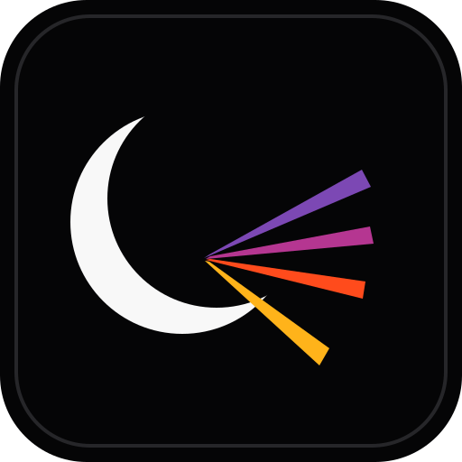

<div align="center">
  

  <h1>LUNOR</h1>

  <p><strong>Presença · preparo · propósito</strong></p>

  <p>
    A plataforma operacional para igrejas que conecta <strong>liderança, equipes e famílias</strong><br />
    do planejamento do culto à execução do domingo.
  </p>

  <p>
    <a href="https://lunorservice.com"><strong>Acessar o LUNOR</strong></a>
  </p>
</div>

<p align="center">
  
  
  
  
  
  
</p>

<p align="center">
  
</p>

---

## O que é o LUNOR

O **LUNOR** é uma plataforma de operação e gestão ministerial para igrejas.

Ele organiza, em um único ambiente, as informações que normalmente ficam espalhadas entre grupos de WhatsApp, planilhas, formulários, calendários e ferramentas diferentes: **quem vai servir, onde vai servir, quando está disponível, o que precisa preparar e o que precisa acontecer no culto**.

O objetivo é simples: reduzir atrito operacional para que líderes tenham visão, voluntários tenham clareza e cada ministério consiga chegar mais preparado ao serviço.

> **LUNOR — Presença · preparo · propósito.**
>
> Presença para saber quem está disponível. Preparo para organizar pessoas, repertórios e operação. Propósito para manter a tecnologia a serviço daquilo que realmente importa.

---

## Uma plataforma, vários ministérios

| Área | O que o LUNOR organiza |
|---|---|
| **Escalas & disponibilidade** | Cultos, funções, convites, confirmações, indisponibilidades, trocas e visão da equipe |
| **LUNOR Louvor** | Acervo, repertórios, cifras, tons, BPM, compasso, YouTube, materiais e preparação musical |
| **LUNOR Kids** | Crianças, responsáveis, recepção, check-in, etiquetas, retirada segura e operação das salas |
| **Pessoas & ministérios** | Perfis, equipes, funções, permissões, departamentos e campus |
| **Operação** | Ordem do culto, acompanhamento das escalas, equipamentos e manutenção |

---

## Escalas que começam antes da escala

O LUNOR não trata escala apenas como uma lista de nomes. O fluxo começa pela **disponibilidade** e termina na execução do culto.

- Solicitação e envio de disponibilidade por período.
- Visão por **mês, campus e ministério**.
- Escala de pessoas por função e área de serviço.
- Confirmação do voluntário e acompanhamento de pendências.
- Trocas e substituições quando necessário.
- Visão de carga para evitar concentração sempre nas mesmas pessoas.
- Próximo serviço em destaque para o voluntário.
- Exportação para calendário (`.ics`).
- Experiência pensada para uso rápido no celular.

### Fluxo operacional

```text
DISPONIBILIDADE → CULTO → ESCALA → CONFIRMAÇÃO → PREPARO → SERVIÇO
```

---

## LUNOR Louvor

Um espaço dedicado à rotina real de um time de música — do acervo ao domingo.

### Acervo musical

- Cadastro e organização de músicas.
- Título, artista, tom original, BPM e compasso.
- Letra e cifra no próprio LUNOR.
- Importação e cadastro a partir do **YouTube**.
- Links e materiais de referência para preparação.

### Cifras e tons

- Cifras armazenadas junto à música.
- Alteração do tom para cada culto sem modificar o tom original do acervo.
- **Transposição de acordes em tempo real**.
- Suporte a conteúdo em formatos de cifra estruturados e texto.

### Repertórios

- Criação do repertório de cada culto.
- Ordenação das músicas.
- Definição de tom por música e por serviço.
- Informações de preparação concentradas em um único lugar.
- Repertório conectado à escala da equipe.

O resultado é um fluxo único entre **música, repertório, músico, escala e culto**.

---

## LUNOR Kids

O Kids foi desenhado para unir **agilidade na recepção** com **segurança na entrega da criança**.

### Crianças e responsáveis

- Cadastro de crianças e informações relevantes para o atendimento.
- Relacionamento com responsáveis autorizados.
- Organização por salas, faixas e contexto do ministério.
- Histórico e dados centralizados para a equipe autorizada.

### Recepção e check-in

- Busca rápida na recepção.
- Entrada da criança na sessão do culto.
- Geração de **etiquetas próprias para identificação**.
- Fluxo preparado para operação mobile.

### Retirada segura

- Identificação por **QR Code**.
- Conferência do responsável autorizado.
- Registro de retirada/check-out.
- Controles adicionais para exceções e ações de liderança.

### Equipe Kids

O módulo também utiliza o mesmo motor de **disponibilidade e escalas** do LUNOR, mantendo a experiência consistente entre ministérios.

---

## Mobile-first de verdade

O LUNOR é construído priorizando a operação no celular, porque é ali que boa parte da rotina da igreja acontece.

- Interface responsiva para desktop e mobile.
- **PWA instalável** na tela inicial.
- Manifest e service worker próprios.
- Empacotamento mobile com **Capacitor** para Android e iOS.
- Ícone e identidade visual próprios do aplicativo.
- Navegação focada nas ações mais importantes de cada perfil.

---

## Multi-igreja, multi-campus e permissões

A aplicação foi desenhada para crescer sem misturar contexto ou dados.

- Estrutura **multi-tenant** por igreja.
- Suporte a múltiplos campus.
- Pessoas podem participar de diferentes ministérios.
- Permissões e responsabilidades por contexto.
- Dados sensíveis protegidos também no banco através de **Row Level Security (RLS)**.
- Testes específicos para isolamento entre tenants.

---

## Arquitetura

| Camada | Tecnologia |
|---|---|
| **Frontend** | Next.js 16 · React 19 · TypeScript |
| **UI** | Tailwind CSS 4 · Base UI · shadcn · Lucide |
| **Backend** | Supabase |
| **Banco** | PostgreSQL + Row Level Security |
| **Auth** | Supabase Auth |
| **Validação** | Zod |
| **Deploy web** | Cloudflare Workers + OpenNext |
| **Mobile** | PWA + Capacitor 8 |
| **Testes** | Vitest + testes de RLS |

### Visão simplificada

```text
┌─────────────────────────────────────────────┐
│                  LUNOR UI                   │
│        Next.js · React · PWA · Mobile       │
└──────────────────────┬──────────────────────┘
                       │
            ┌──────────▼──────────┐
            │   Aplicação / APIs   │
            │ Next.js + OpenNext   │
            └──────────┬──────────┘
                       │
       ┌───────────────▼────────────────┐
       │            Supabase             │
       │ Auth · Postgres · RLS · Storage │
       └───────────────┬────────────────┘
                       │
            ┌──────────▼──────────┐
            │ Cloudflare Workers   │
            │   Runtime / Deploy   │
            └─────────────────────┘
```

---

## Desenvolvimento local

### Requisitos

- Node.js 20+
- npm
- Docker, caso utilize o Supabase local
- Supabase CLI

### Instalação

```bash
git clone <url-do-repositorio>
cd lunor
npm install
cp .env.example .env.local
```

Configure as variáveis necessárias no `.env.local` e então:

```bash
npx supabase start
npx supabase db reset
npm run dev
```

A aplicação ficará disponível em:

```text
http://localhost:3000
```

### Comandos principais

| Comando | Uso |
|---|---|
| `npm run dev` | Desenvolvimento local |
| `npm run build` | Build de produção |
| `npm run lint` | ESLint |
| `npm test` | Testes com Vitest |
| `npm run cf:build` | Build para Cloudflare/OpenNext |
| `npm run cf:preview` | Preview do build Cloudflare |
| `npm run cf:deploy` | Deploy via OpenNext |
| `npm run mobile:sync` | Sincroniza o projeto Capacitor |
| `npm run mobile:android` | Sincroniza Android |
| `npm run mobile:ios` | Sincroniza iOS |

As migrations do banco ficam em [`supabase/migrations`](supabase/migrations).

---

## Estrutura do produto

```text
LUNOR
├── Início
├── Escalas
├── Disponibilidade
├── Pessoas
├── Louvor
│   ├── Acervo
│   ├── Repertórios
│   ├── Escalas
│   └── Disponibilidade
├── Kids
│   ├── Crianças
│   ├── Responsáveis
│   ├── Sessões
│   ├── Check-in / Check-out
│   └── Escalas
├── Equipamentos
└── Administração
```

A interface apresentada a cada usuário depende do seu contexto, permissões e ministérios.

---

## Princípios do LUNOR

**1. Simples para quem serve**  
O voluntário precisa encontrar rapidamente sua próxima escala, sua função, sua disponibilidade e aquilo que precisa preparar.

**2. Poderoso para quem lidera**  
O líder precisa enxergar equipe, confirmação, cobertura, repertório e operação sem depender de várias ferramentas paralelas.

**3. Modular por natureza**  
Louvor, Kids e outros ministérios compartilham a mesma base, mas cada área recebe fluxos próprios quando a operação exige.

**4. Segurança no nível certo**  
Permissão não é apenas elemento de interface. O isolamento de dados também é aplicado no banco.

**5. Menos administração, mais clareza**  
A tecnologia deve reduzir trabalho repetitivo e deixar evidente o próximo passo de cada pessoa.

---

## Status

O LUNOR está em **evolução ativa**, com foco atual em consolidar a experiência de operação real da igreja, especialmente nos módulos de **Louvor, Kids, escalas e disponibilidade**.

Novas funcionalidades são validadas pelo impacto operacional antes de serem incorporadas ao fluxo principal.

---

## Marca

**LUNOR**  
**Presença · preparo · propósito**

A identidade visual oficial utilizada pelo produto está em [`public/brand`](public/brand) e [`public/icons`](public/icons).

<div align="center">
  <br />
  
  <br /><br />
  <strong>LUNOR</strong><br />
  <sub>Presença · preparo · propósito</sub>
</div>
